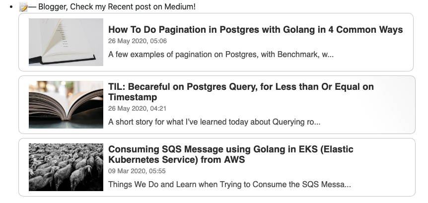

# github-readme-medium-recent-article

**Howdy there!!!**


Show your recent published article from Medium on your Readme. See the live [demo](https://github.com/bxcodec)


## Index

* [Support](#support)
* [Getting Started](#getting-started)
* [Contribution](#contribution)


## Support
You can file an [Issue](https://github.com/bxcodec/github-readme-medium-recent-article/issues/new)

## Getting Started
#### Usage

Import this link in Readme as image source.

**Format:**
```bash
  https://github-readme-medium-recent-article.vercel.app/medium/<medium-username>/<article-index>
```
- `medium-username`: your medium username/profile
- `article-index` : your recent article index. e.g: `0` means your latest article. 

#### Example
**Script in Readme.md**

```html
 <a target="_blank" href="https://github-readme-medium-recent-article.vercel.app/medium/@imantumorang/0"> 

<a target="_blank" href="https://github-readme-medium-recent-article.vercel.app/medium/@imantumorang/2"> 

```
**Result**

<a target="_blank" href="https://github-readme-medium-recent-article.vercel.app/medium/@imantumorang/0">

<a target="_blank" href="https://github-readme-medium-recent-article.vercel.app/medium/@imantumorang/2">


## Inspirations and Thanks

- [Alif Readme Profile](https://github.com/alfari16/alfari16) for the initial idea


## Contribution
---

To contrib to this project, you can open a PR or an issue.

- Fix styling issue (2025/6/17)

- Code cleanup (2025/6/18)

- Add unit tests (2025/6/21)

- Refactor code (2025/5/4)

- Update dependencies (2025/6/21)

- Update README (2025/3/27)

- Improve performance (2025/5/5)

- Update dependencies (2025/4/18)

- Code cleanup (2025/5/16)

- Add new feature (2025/4/28)

- Code cleanup (2025/3/29)

- Update documentation (2025/5/26)

- Add new feature (2025/5/14)

- Refactor code (2025/5/2)

- Refactor code (2025/3/19)

- Fix styling issue (2025/5/28)

- Improve performance (2025/6/1)

- Refactor code (2025/5/27)

- Update README (2025/5/3)

- Update documentation (2025/3/14)

- Add unit tests (2025/4/5)

- Add unit tests (2025/5/19)

- Improve performance (2025/5/17)

- Update documentation (2025/6/5)

- Add unit tests (2025/1/29)
